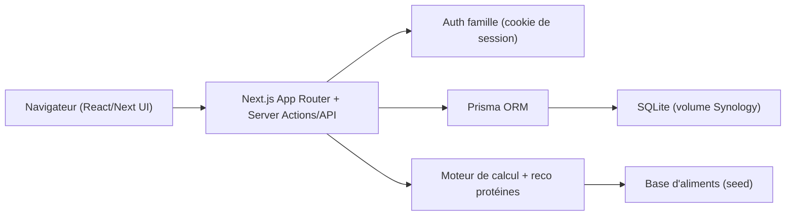

# Coach Nutrition & Sport - Plan

Application web autonome (hors-ligne, gratuite) déployée en Docker sur NAS Synology.

## Choix validés
- **Utilisateurs** : famille (login simple avec comptes)
- **Stack** : Next.js (App Router, TypeScript) full-stack + SQLite via Prisma
- **Conseils** : base d'aliments locale + algorithme déterministe (pas d'IA, pas d'internet requis)

## Architecture

## Modèle de données (Prisma / SQLite)
- `User` : id, name, email, passwordHash
- `Profile` : userId, sexe, dateNaissance, taille(cm), poids(kg), niveauActivite, objectif (PERTE_POIDS / MAINTIEN / MUSCULATION), **vegetarien (bool)**
- `Food` : nom, categorie, kcal/100g, proteines/100g, glucides/100g, lipides/100g, **vegetarien (bool)** (table de seed)
- `MealEntry` : userId, date, moment (matin/midi/soir/collation), foodId, quantite(g) - journal quotidien

## Logique de calcul (ancrée sur les rapports + standards)
Fichier `lib/nutrition.ts` :
- **Métabolisme de base (BMR)** : Mifflin-St Jeor.
- **TDEE** : BMR x facteur d'activité (sédentaire 1.2 -> très actif 1.9).
- **Objectif calorique** : perte de poids = TDEE -15 à -20%, maintien = TDEE, musculation = TDEE +10%.
- **Objectif protéines (g/kg, source rapport Sénat r24-708)** :
  - Adulte sain : 0,83 g/kg/j (référence ANC)
  - Perte de poids : ~1,6 g/kg (préserve le muscle, dans la fourchette sportif 1-2)
  - Musculation : ~1,8-2 g/kg (fourchette sportif)
  - Garde-fou : alerte si > 2,2 g/kg (seuil "élevé" du rapport)
  - Cas particuliers cités : >65 ans 1-1,2 g/kg, ados 0,91 g/kg

## Fonctionnalités / écrans
1. **Auth** : page connexion + création de compte (famille).
2. **Onboarding profil** : poids, taille, âge, sexe, activité, objectif, **case "Végétarien"** -> calcul et affichage des besoins du jour (kcal + protéines).
3. **Journal du jour** : ajout d'aliments (recherche dans la base) + quantité, par moment de repas ; barres de progression kcal et protéines vs objectif. Objectif central = atteindre le quota de protéines.
4. **Moteur de reco** : bouton "Compléter mes protéines" -> propose aliments + quantités (g) pour combler le restant de protéines en respectant le plafond calorique. Algorithme déterministe glouton trié par densité protéique. **Si le profil est végétarien, seuls les aliments végétariens sont proposés** (filtre `vegetarien = true`).

## Structure de fichiers (principaux)
- `app/(auth)/login`, `app/(app)/dashboard`, `app/(app)/journal`, `app/(app)/profil`
- `app/api/*` ou Server Actions pour CRUD repas
- `lib/nutrition.ts` (formules), `lib/reco.ts` (moteur de suggestion, filtre végétarien), `lib/auth.ts`, `lib/db.ts`
- `prisma/schema.prisma`, `prisma/seed.ts` (base d'aliments FR de départ, avec indicateur végétarien)
- `Dockerfile`, `docker-compose.yml`, `README.md` (déploiement Synology)
- UI accessible (RGAA) : labels, contrastes, navigation clavier, ARIA sur barres de progression

## Déploiement Synology
- `Dockerfile` (Next.js standalone) + `docker-compose.yml` montant un volume pour la base SQLite (persistance).
- Variables d'env : `DATABASE_URL`, `AUTH_SECRET`.
- README : build de l'image, import dans Container Manager, mapping de port + volume.

## Hypothèses
- Base d'aliments initiale = ~50-100 aliments courants (valeurs nutritionnelles standard), chacun marqué végétarien ou non ; extensible.
- Le poids reste saisi dans le profil (nécessaire au calcul des besoins) mais **il n'y a plus de suivi/historique du poids ni de courbe de progression**.
- Saisie en grammes ; pas de scan code-barres en V1.
- Accessibilité conforme RGAA appliquée dès le départ.
